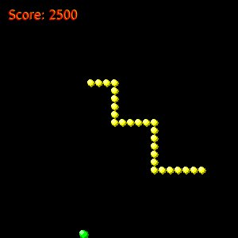

Here is a game of snake, written in python. It's another of the
'write it to see if you can' things. This took a few hours, mainly because
my brain just could not deal with the snake's head being the *last* thing
in the array. I had to draw out the grid on paper and everything.

You will die if you hit a wall. That is intentional; I prefer it.

The code probably contains many idioms from the 'invent with python' series,
https://inventwithpython.com/pygame/chapters/,
since that's how I'm learning to use pygame,
but I haven't yet looked at their 'snake' implementation. It's probably
much better than this one. :)

TODO: 

* Give game a soundtrack
